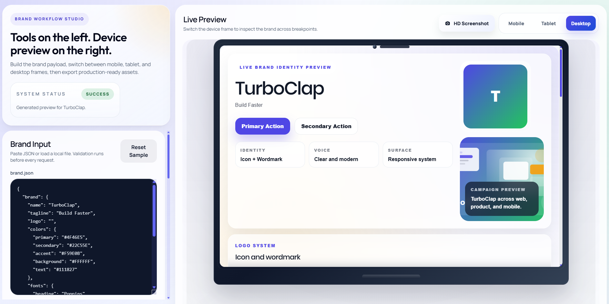
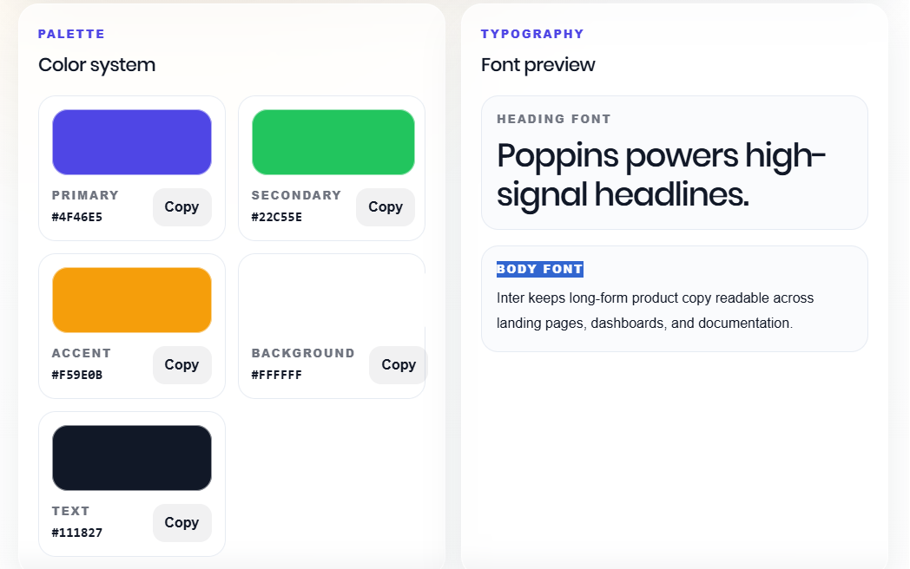
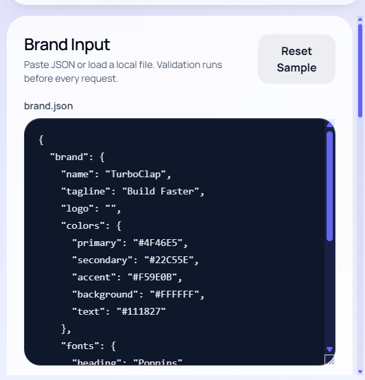
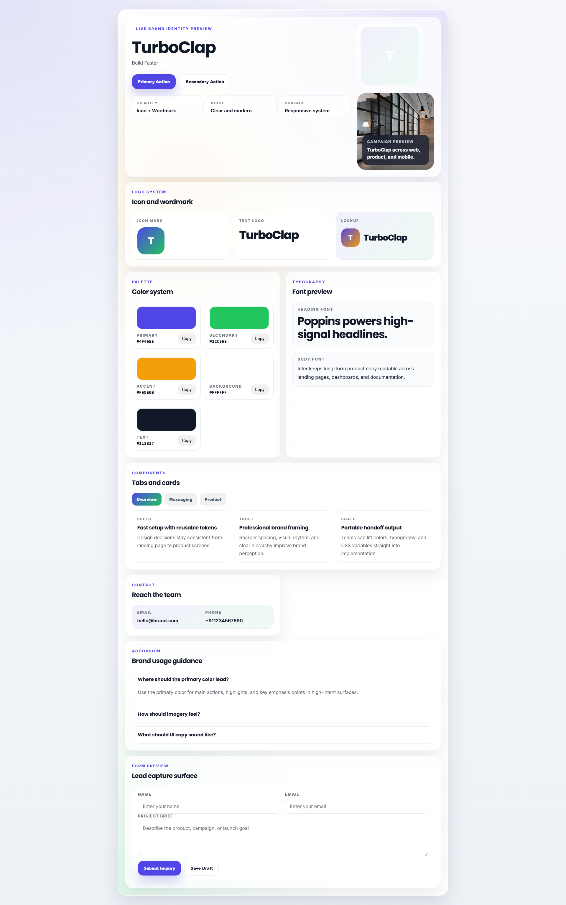
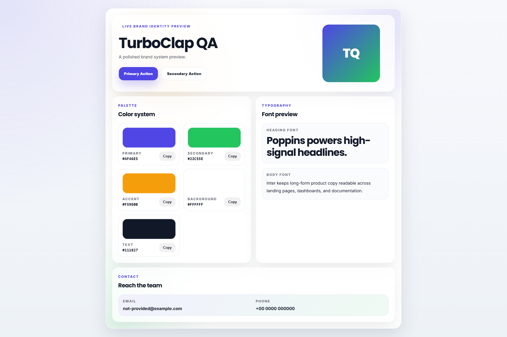

⭐ If you find this useful, please star the repo!


# turboclap-brand-ui-generator

Generate a validated brand preview UI, portable HTML export, and developer-ready design tokens from a single `brand.json` file.

## 🔗 Live Demo

👉 https://turboclap.com/web-tools/brand-ui-generator/


## Features

- Paste brand JSON directly into the app.
- Upload a `.json` file and render a live preview.
- Validate required fields before rendering.
- Render a full brand presentation with logo, typography, colors, buttons, and contact details.
- Export a standalone HTML preview into `/exports`.
- Generate Tailwind config output for engineering handoff.
- Generate CSS variable tokens for direct frontend use.
- Copy individual color hex values from the preview.
- Includes sample brand files for fast testing.

## 📸 Screenshots

### Preview


### Colors


### Exported HTML



### Template Full Preview



### Card Preview



template-preview.png


## Example JSON

```json
{
  "brand": {
    "name": "TurboClap",
    "tagline": "Build Faster",
    "logo": "https://via.placeholder.com/320x320.png?text=TurboClap",
    "colors": {
      "primary": "#4F46E5",
      "secondary": "#22C55E",
      "accent": "#F59E0B",
      "background": "#FFFFFF",
      "text": "#111827"
    },
    "fonts": {
      "heading": "Poppins",
      "body": "Inter"
    },
    "contact": {
      "email": "hello@brand.com",
      "phone": "+911234567890"
    }
  }
}
```

## How To Run

```bash
php -S localhost:8000
```

Open [http://localhost:8000](http://localhost:8000).

## Folder Structure

- `/index.php` contains the app shell and input/export panels.
- `/api/parse.php` validates, sanitizes, renders, and exports brand payloads.
- `/templates/brand-template.php` builds the shared preview and standalone HTML output.
- `/assets/script.js` handles file input, API requests, live updates, copy actions, and downloads.
- `/assets/styles.css` contains the main app styles and preview styling system.
- `/exports/` stores standalone exported HTML files.
- `/examples/` includes sample brand payloads for startup, agency, and personal profiles.
- `/brand.sample.json` provides the default JSON shown on first load.

## Notes

- Required fields: `brand.name` and `brand.colors.primary`.
- The app sanitizes text, URLs, fonts, email, and phone values before rendering.
- Broken logo URLs fall back to an initials-based badge automatically.
- Standalone exports include inline styles and copyable palette controls.

---

Built with ❤️ by TurboClap
